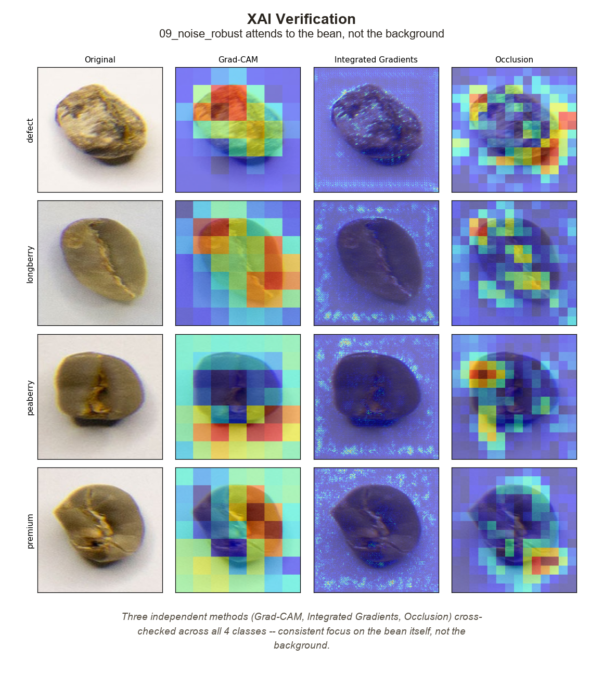

# Model Card -- `09_noise_robust` (Production Model)

This is the dedicated reference for the project's final model: what it is made of, how
it was trained, how well it performs, and where it is known to be weak. For the
step-by-step story of *how* this model was chosen over 9 other candidates, see
[`reports/CBQD - Model Selection Report.html`](reports/CBQD%20-%20Model%20Selection%20Report.html)
and [`docs/results.md`](docs/results.md). For a one-paragraph summary, see the
[README](README.md#final-model--performance).

## 1. Model Details

| | |
|---|---|
| **Name** | `09_noise_robust` -- 5-seed noise-robust deep ensemble |
| **Task** | Single-label image classification, 4 classes (`defect`, `longberry`, `peaberry`, `premium`) |
| **Backbone** | EfficientNet-B0 (ImageNet-1k pretrained, via `torchvision.models`) |
| **Ensemble size** | 5 independently trained models (seeds `42, 43, 44, 45, 46`), combined by softmax averaging |
| **Input** | RGB image, resized to 224x224, ImageNet mean/std normalization |
| **Output** | 4-class probability vector -> `argmax` |
| **Params per member** | ~5.3M (stock EfficientNet-B0) + a 1280->4 linear head |
| **Checkpoints** | `models/checkpoints/09_noise_robust_ensemble_seed{42,43,44,45,46}.pt` (DVC/R2-tracked, ~505MB total for all 18 checkpoints in the repo, see [`docs/data.md`](docs/data.md)) |
| **Framework** | PyTorch / torchvision |
| **Training notebook** | [`notebook/CBQD - 09 Noise-Robust Ensemble.ipynb`](notebook/CBQD%20-%2009%20Noise-Robust%20Ensemble.ipynb) |
| **Diagram** | [`reports/CBQD - Model Architecture Diagram.html`](reports/CBQD%20-%20Model%20Architecture%20Diagram.html) (interactive, full detail) |

## 2. Intended Use

- Classifying single coffee-bean images (one bean per image, plain background, ~256x256
  source resolution) into `defect` / `longberry` / `peaberry` / `premium`, as a
  decision-support signal in a sorting or quality-grading workflow.
- Research and educational use: studying transfer learning, noise-robust training, and
  deep ensembling on a small (~1,150 image), imbalanced-by-difficulty visual dataset.

**Out of scope / not validated for:**
- Fully automated grading decisions without human review -- see Section 6 (real-world
  confidence gap).
- Multi-bean images, cluttered backgrounds, or bean types/origins not represented in the
  training data.
- Any use as a food-safety or health/safety determination. This is a visual quality
  classifier, not a certified inspection instrument.

## 3. Architecture (Detailed)

The production artifact is **not a single network** -- it is five independently trained
EfficientNet-B0 classifiers whose predictions are averaged at inference time. Each of
the five follows the same architecture and training recipe, differing only in random
seed.


*Diagram legend: orange = mislabel-scoring path (data quality), purple = EfficientNet-B0
backbone path, gray = loss/aggregation steps, green = final output. The dashed card with
the stacked-shadow effect marks the block that is repeated 5 times independently (once
per seed) before the outputs are combined.*

### 3.1 Per-seed model

```
Input: 224x224x3 RGB (ImageNet-normalized)
  |
  v
Stem: Conv 3x3, 32 channels
  |
  v
7x MBConv stages (16 -> 320 channels)     <- EfficientNet-B0 backbone, ImageNet-pretrained
  |
  v
Head: global pool -> 1280 channels
  |
  v
Classifier: Linear(1280 -> 4)             <- replaces ImageNet's 1000-class head, trained from scratch
  |
  v
Logits (4 values) -> softmax
```

### 3.2 Noise-robust training path (why this model exists)

`09_noise_robust` implements roadmap item #9 from
[`docs/modeling-strategy.md`](docs/modeling-strategy.md#4-10-rekomendasi-model): EDA found
~4.5% of training images are plausible mislabel candidates (proxy-based, not ground
truth). Rather than dropping them, training runs two parallel paths that meet at the
loss function:

1. **Mislabel-scoring path** (runs once, reused by all 5 seeds): the same 11 hand-crafted
   features used in the EDA baseline (color, shape, texture) are fed into a
   `RandomForestClassifier` evaluated out-of-fold with cluster-aware
   `StratifiedGroupKFold` (so a bean never "sees itself" via a near-duplicate in another
   fold). `mistake_score = max_proba - true_proba` per sample; scores above a tuned
   threshold get down-weighted to `0.751` instead of `1.0` in the loss (soft
   down-weighting, not hard exclusion -- see
   [`docs/preprocessing-recommendations.md` §4a](docs/preprocessing-recommendations.md)
   for why exclusion was rejected).
2. **Classification path**: the image goes through the EfficientNet-B0 backbone described
   in 3.1.

Both meet at a **sample-weighted, label-smoothed cross-entropy loss**
(`label_smoothing=0.1255`), i.e. the per-sample mislabel weight scales that sample's
contribution to the loss.

### 3.3 Training procedure

- **Two-phase transfer learning**: phase 1 trains only the new classifier head with the
  backbone frozen; phase 2 unfreezes the backbone and fine-tunes end-to-end at a lower
  learning rate. This two-phase schedule is standard for transfer learning on datasets
  this small (~1,150 training images) to avoid destroying pretrained features early.
- **Augmentation**: horizontal + vertical flip, random rotation (±180°), light random
  affine translation (10%), mild color jitter (brightness/contrast 0.1, saturation
  0.05) -- deliberately conservative on color, since EDA found color is a genuine class
  signal (η²=0.22-0.24), not noise to be augmented away. See
  [`docs/preprocessing-recommendations.md` §6](docs/preprocessing-recommendations.md).
- **Hyperparameters** (Optuna-tuned, see [`docs/results.md`](docs/results.md) for the
  search and the other two tuned candidates):

  | Hyperparameter | Value |
  |---|---|
  | `lr_phase1` | 0.000241 |
  | `lr_phase2` | 0.000442 |
  | `weight_decay` | 0.000288 |
  | `batch_size` | 16 |
  | `scheduler_factor` | 0.437 |
  | `scheduler_patience` | 2 |
  | `label_smoothing` | 0.1255 |
  | `mislabel_weight` | 0.751 |
  | `mistake_threshold` | 0.426 |

### 3.4 Ensemble combination

Each of the 5 seeds is trained fully independently (own weight init, own data
shuffling). At inference, the 4-class softmax outputs of all 5 models are
**averaged** (soft voting), then `argmax` picks the final class. This happens *after*
training -- it is not part of any single model's forward pass.

## 4. Training Data

- ~1,150-1,211 training images (4 classes, near-balanced, ratio 1.033), 256x256 RGB,
  one bean per image on a plain background. See [`docs/data.md`](docs/data.md) for the
  public source and [`docs/preprocessing-recommendations.md`](docs/preprocessing-recommendations.md)
  for the full cleaning pipeline (exact/near-duplicate removal, cluster-aware split).
- Split: cluster-aware `StratifiedGroupKFold` (5-fold) -- fold 4 held out as the labeled
  test set, folds 0-3 used for training/validation. This prevents near-duplicate beans
  from leaking across train/test.
- A separate `real_world/` set (the original unlabeled Kaggle "test" folder) is carried
  through preprocessing but has **no ground-truth labels** -- it is used only to probe
  generalization confidence (Section 6), never to compute accuracy.

## 5. Evaluation Results

Final 5-seed ensemble, evaluated on the held-out labeled test split
(`metadata/09_noise_robust_ensemble_summary.csv`):

| Metric | Value |
|---|---|
| Test macro-F1 | **0.9611** |
| Test accuracy | 0.9610 |
| Recall -- `defect` | 0.9322 |
| Recall -- `longberry` | 1.0000 |
| Recall -- `peaberry` | 0.9655 |
| Recall -- `premium` | 0.9474 |
| Real-world (unlabeled) mean confidence | 0.7323 |

Ensemble vs. individual seeds:

| | Value |
|---|---|
| Mean of 5 individual seeds (independent seed-sweep) | 0.9540 ± 0.0171 |
| Best individual seed (this run) | 0.9697 |
| Worst individual seed (this run) | 0.9304 |
| Ensemble vs. mean individual | **+0.0071** |
| Ensemble vs. best individual | -0.0086 |

**Reading this table:** the ensemble beats the *average* individual seed and, more
importantly, is far more stable than any single seed (individual std 0.0171 macro-F1
across identical reruns). It doesn't always beat the single luckiest seed -- that's
expected and is exactly why a single checkpoint was rejected as the production artifact
in favor of the ensemble. Full reasoning: `reports/CBQD - Model Selection Report.html`,
sections "Repeated-Seed Stability" and "Ensemble".

**Beats mandatory baseline?** Yes -- the required gate is beating the 73% hand-crafted
RandomForest baseline (see [`docs/modeling-strategy.md` §3](docs/modeling-strategy.md)).
`09_noise_robust` clears it with a wide margin (0.961 vs. 0.744 macro-F1 for
`01_gradient_boosting`, the closest baseline-style model in the bake-off).

**Why this model over the alternatives?** Full 10-model bake-off, HPO on the top-3, and
XAI verification are summarized in [`docs/results.md`](docs/results.md). Short version:
HPO alone made `08_multitask` look best (+3pp to 0.970), but that gain did not reproduce
across seeds; 4-fold CV showed `09_noise_robust` was both the highest-scoring *and* most
stable of the top-3 HPO candidates; XAI found no shortcut-learning red flags on it.

## 6. Known Limitations

- **Real-world generalization gap**: mean softmax confidence on the unlabeled
  `real_world/` set is only 0.7323, well below the near-certain confidence typical on
  the in-distribution test set. This is a **confidence** gap, not a measured accuracy
  gap (no ground truth exists for `real_world/`) -- read it as "the model is less sure
  of itself outside the curated test distribution," and treat any deployment on genuinely
  new images with corresponding caution / human review.
- **Small training set** (~1,150 images): standard deep-learning generalization
  caveats apply. The ensemble and conservative augmentation strategy exist specifically
  to mitigate this, not to eliminate it.
- **Proxy-based mislabel handling, not ground truth**: the mislabel weighting relies on
  a RandomForest proxy that is itself imperfect (see
  [`docs/preprocessing-recommendations.md` §4a](docs/preprocessing-recommendations.md)).
  Some down-weighted samples may in fact be correctly labeled, and vice versa.
- **Chromatic aberration** (purple/blue fringing at bean edges) is present across all
  classes in the source images (EDA finding) and is *not* a class signal -- if you see
  attention/saliency maps highlighting edges strongly, cross-check against this known
  artifact before interpreting it as a learned feature.
- **XAI scope**: interpretability analysis (5 hypotheses x 5 methods, see
  [`docs/xai-strategy.md`](docs/xai-strategy.md)) found no disqualifying shortcut-learning
  evidence for this model, but XAI evidence is diagnostic, not a formal guarantee of
  correctness.

  

## 7. How to Use

```python
import torch
from torchvision import models as tv_models, transforms as T
from PIL import Image

IMG_SIZE = 224
CLASS_NAMES = ["defect", "longberry", "peaberry", "premium"]
IMAGENET_MEAN, IMAGENET_STD = [0.485, 0.456, 0.406], [0.229, 0.224, 0.225]
SEEDS = [42, 43, 44, 45, 46]

def build_model():
    m = tv_models.efficientnet_b0(weights=None)
    in_f = m.classifier[-1].in_features
    m.classifier[-1] = torch.nn.Linear(in_f, len(CLASS_NAMES))
    return m

transform = T.Compose([
    T.Resize((IMG_SIZE, IMG_SIZE)),
    T.ToTensor(),
    T.Normalize(IMAGENET_MEAN, IMAGENET_STD),
])

models_ = []
for seed in SEEDS:
    m = build_model()
    m.load_state_dict(torch.load(f"models/checkpoints/09_noise_robust_ensemble_seed{seed}.pt", map_location="cpu"))
    m.eval()
    models_.append(m)

img = transform(Image.open("path/to/bean.jpg").convert("RGB")).unsqueeze(0)

with torch.no_grad():
    probs = torch.stack([torch.softmax(m(img), dim=1) for m in models_]).mean(dim=0)

pred_idx = probs.argmax(dim=1).item()
print(CLASS_NAMES[pred_idx], probs[0, pred_idx].item())
```

See [`docs/data.md`](docs/data.md) for how to obtain the checkpoint files (DVC/R2, or
request access) and [`docs/reproducing-training.md`](docs/reproducing-training.md) to
retrain from scratch instead.

## 8. References

- [`reports/CBQD - Model Architecture Diagram.html`](reports/CBQD%20-%20Model%20Architecture%20Diagram.html) -- interactive full architecture diagram (source for Section 3)
- [`reports/CBQD - Model Selection Report.html`](reports/CBQD%20-%20Model%20Selection%20Report.html) -- the full 9-phase selection journey
- [`notebook/CBQD - 09 Noise-Robust Ensemble.ipynb`](notebook/CBQD%20-%2009%20Noise-Robust%20Ensemble.ipynb) -- training code
- [`notebook/CBQD - XAI 09-Noise-Robust Full.ipynb`](notebook/CBQD%20-%20XAI%2009-Noise-Robust%20Full.ipynb) -- interpretability analysis for this model
- [`docs/modeling-strategy.md`](docs/modeling-strategy.md), [`docs/preprocessing-recommendations.md`](docs/preprocessing-recommendations.md), [`docs/xai-strategy.md`](docs/xai-strategy.md)
- [`docs/results.md`](docs/results.md) -- full 10-model comparison and HPO results
